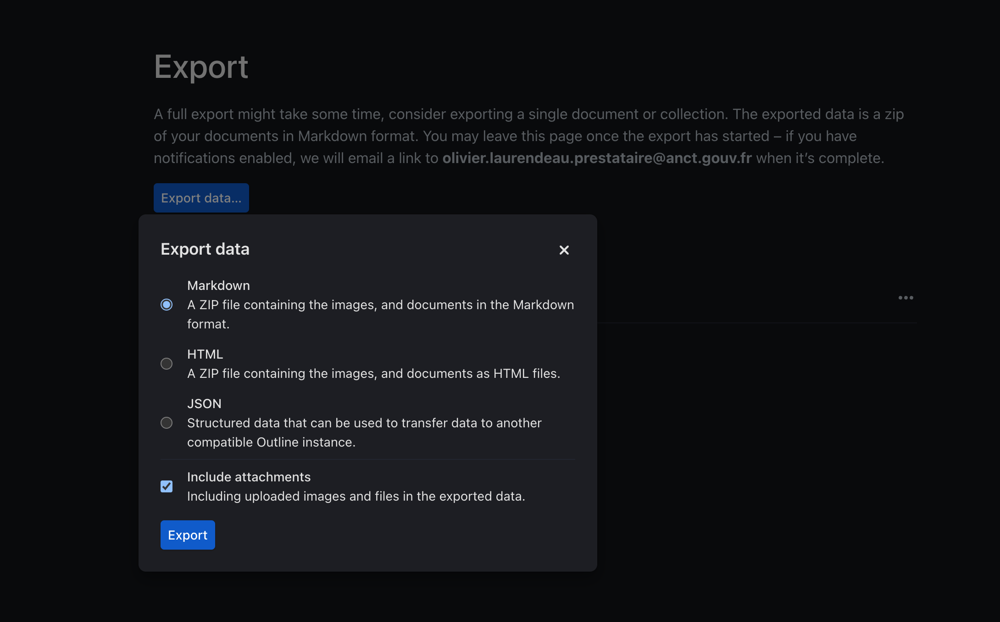
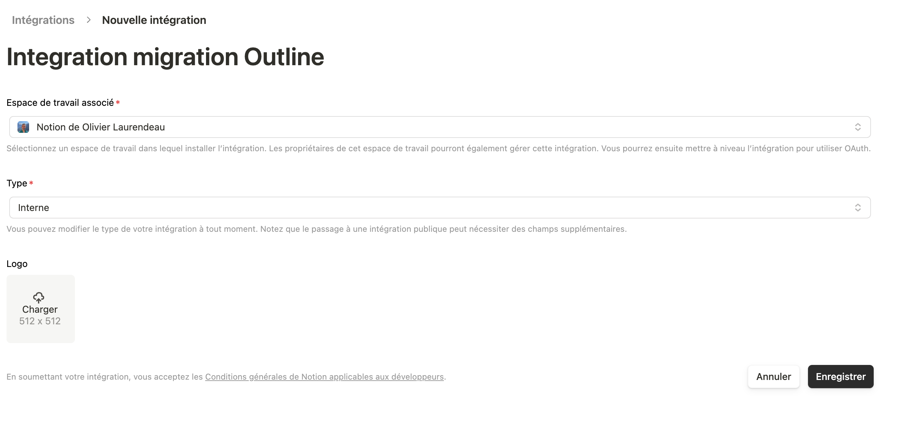
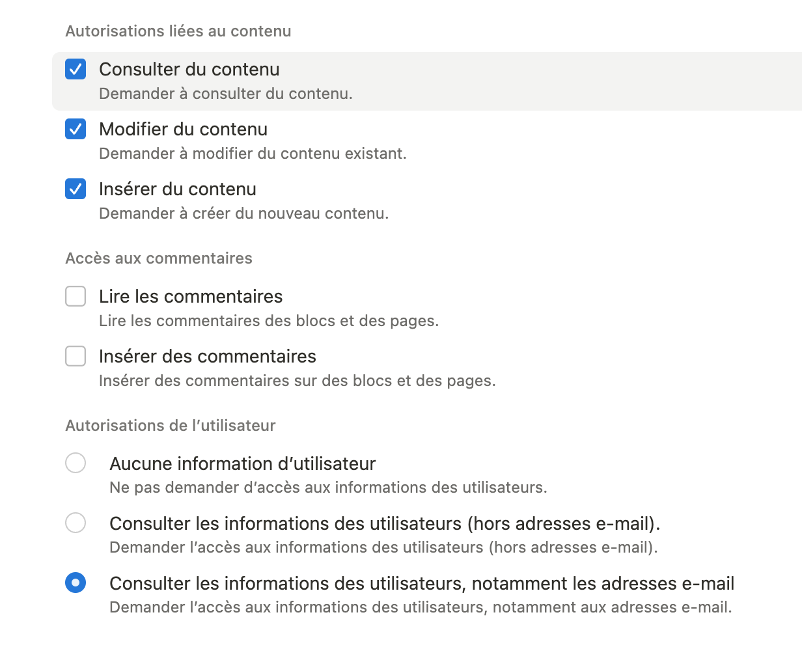
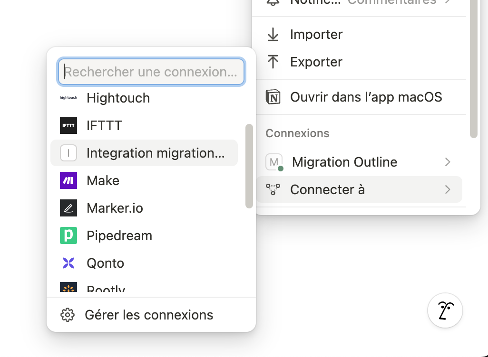

# migrate-outline-to-notion
Migration tool to migrate from outline to notion

## How to perform the migration

### Export from Outline

From Outline admin panel, export the data in Markdown format with attachments.



### Setup Notion

1. Create a new integration in Notion [on this screen](https://www.notion.so/profile/integrations/form/new-integration) and save the token for later




2. Create a new page in Notion and configure the integration on this page



### Run the migration

```bash
# Clone the repository
git clone git@github.com:incubateur-territoires/migrate-outline-to-notion.git

# Go to the project directory
cd migrate-outline-to-notion

# Copy the environment variables file and adapt it
cp .env.template .env

# Run the migration
npm run migrate
```
